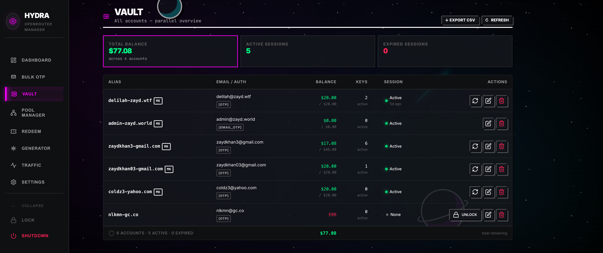
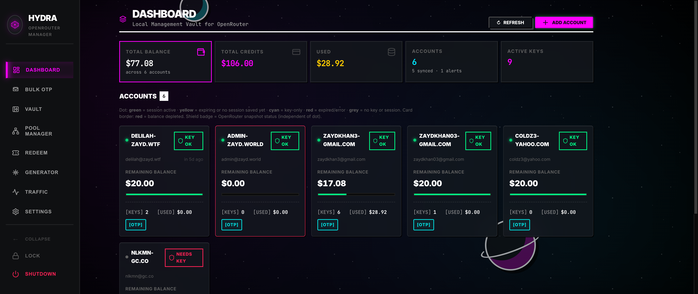
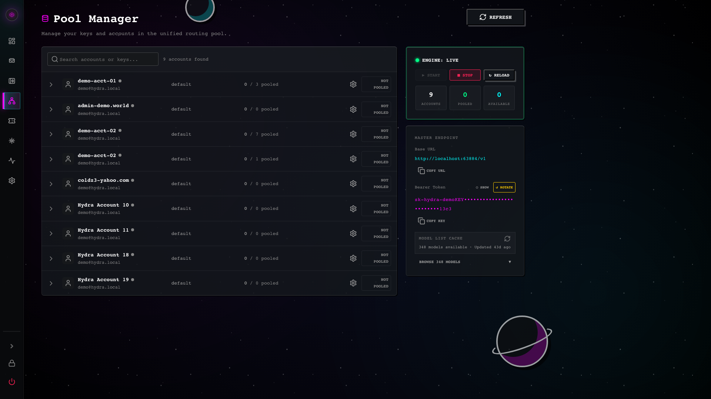
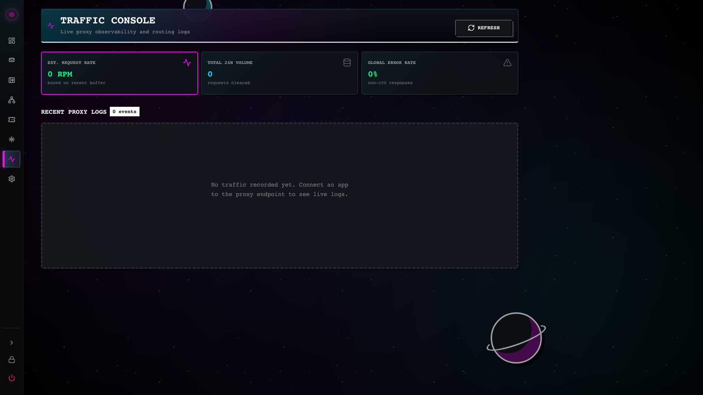

# Hydra

<p align="center">
  <a href="https://github.com/zaydiscold/hydra/actions/workflows/ci.yml"></a>
  <a href="https://github.com/zaydiscold/hydra/actions/workflows/release.yml"></a>
  <a href="https://github.com/zaydiscold/hydra/actions/workflows/docker.yml"></a>
  <a href="https://github.com/zaydiscold/hydra/releases/latest"></a>
</p>

<p align="center">
  
</p>

<p align="center">
  <strong>Local-first OpenRouter fleet manager, desktop control plane, and OpenAI-compatible API router.</strong>
</p>

<p align="center">
  
  
  
  
  <a href="openapi/hydra-api.openapi.json"></a>
</p>

Hydra is a packaged Electron app for running an OpenRouter account fleet from one local machine. It combines encrypted local storage, account/session management, key provisioning, promo-code workflows, live traffic visibility, a scriptable CLI, and an OpenAI-compatible `/v1` proxy that can stay running as an API router.

It is designed for operators who want a native control plane without shipping account secrets to a hosted service.

Hydra is useful in two ways at once:

- Open the desktop app when you want a visual command center for accounts, sessions, keys, imports, redemption, and traffic.
- Leave the router running in the background when local tools need an OpenAI-compatible endpoint backed by your pooled OpenRouter credentials.
- Use the `hydra` CLI when you want the same operational facts in a terminal, a script, or an agent workflow.

<p align="center">
  
</p>

<p align="center">
  
</p>

## Navigation

- [Start Here](#start-here)
- [Feature Tour](#feature-tour)
- [Install](#install)
- [Quick Start From Source](#quick-start-from-source)
- [Desktop App](#desktop-app)
- [CLI](#cli)
- [Local API Router](#local-api-router)
- [Operator Hardening](#operator-hardening)
- [Development And Release Gates](#development-and-release-gates)
- [Docs Index](#docs-index)
- [Versioning](docs/VERSIONING.md)
- [Gallery](#gallery)

## Start Here

Hydra keeps local OpenRouter operations in one place:

| Need | Where to go |
| --- | --- |
| See fleet health quickly | **Command**: scroll the account viewport in Grid, scan aligned rows in List, or open the topology Map. |
| Import existing accounts | **Bulk Import**: use the sequential direct-HTTPS OTP queue. |
| Inspect saved logins | **Vault**: review account state and live-session evidence. |
| Decide which keys may route | **Pool Manager**: enable accounts and keys with forgiving controls. |
| Redeem codes across accounts | **Code Redeemer**: preflight first, then run a selected batch. |
| Understand a failed local request | **Traffic Console**: inspect route attempts, status, model, latency, token count, and price. |
| Adjust desktop behavior | **Settings**: Touch ID, telemetry, UI density, account proxies, and diagnostics. |
| Automate without the GUI | **CLI** and the local **MCP** server. |

The local proxy is OpenAI-compatible, so many SDKs can point at Hydra by
changing only the base URL and local Hydra key. Hydra then selects an eligible
pooled OpenRouter credential, applies cooldown behavior, and leaves a local
traffic trail that explains what happened.

## Feature Tour

- **Native desktop control plane**: Electron shell with an embedded Express API, tray/menu lifecycle, platform-native user data paths, and packaged runtime resources.
- **OpenAI-compatible local router**: `/v1/models` and `/v1/chat/completions` proxy traffic through the managed OpenRouter key pool.
- **Readable Traffic Console**: each recent request shows route attempt, outcome, model, account, key, client, latency, input/output tokens, and input/output price. Exact OpenRouter usage cost wins when upstream returns it; cached catalog prices provide an explicit estimate fallback.
- **Long-running API behavior**: bounded proxy concurrency, bounded multi-key failover, buffered request-log writes, log rotation, request-log retention, upstream health checks, and graceful shutdown paths.
- **Fleet account operations**: add accounts, track session health, provision management keys, sync balances, and inspect account readiness.
- **Account import and signup lanes**: existing OpenRouter accounts use the direct HTTPS OTP queue; new signup uses Generator with an isolated visible browser when upstream human verification is required.
- **Key pool management**: rotate across pooled keys, cool down rate-limited keys, disable unhealthy keys, and expose a single local Hydra proxy key.
- **Account proxy pool**: optional encrypted per-task proxy list for signup, key, and code flows, including direct HTTPS and browser fallbacks.
- **Promo-code workflows**: preflight readiness, redeem against selected accounts, and keep redemption history.
- **Local-first security**: local vault password, Touch ID unlock on supported Macs with a durable Settings opt-out, encrypted secrets, owner-only data directories, redacted CLI output, and loopback-first network binding.
- **Scriptable operator CLI**: JSON-friendly commands for automation, diagnostics, imports/exports, fleet scans, and router lifecycle control.
- **Operator-friendly desktop polish**: a bounded Command account viewport, true dense List rows, labeled sidebar hover tips, stronger proximity feedback, persisted Bulk Import activity, content-wide density controls, compact redemption layout, and a launch-bounded ambient moon orbit.
- **Release-oriented quality gates**: linting, Electron packaging checks, API integration tests, UI static contracts, OpenAPI coverage, Docker smoke checks, and Windows path compatibility checks.

## Install

Use the packaged release artifact for your platform:

| Platform | Artifact | Notes |
| --- | --- | --- |
| macOS | `Hydra.app` / zip | Boots the embedded server and native desktop window. |
| Windows | `Hydra Setup.exe` | Uses `%APPDATA%\\Hydra\\` for app data. |
| Linux | `Hydra-*.AppImage` | Active x64 desktop package with updater metadata. |

On first launch, Hydra creates an encrypted local vault and an empty SQLite database in the platform user-data directory. Closing the app window does not have to kill the router; quit from the tray/menu when you want the server fully stopped.

## Quick Start From Source

```bash
git clone https://github.com/zaydiscold/hydra.git
cd hydra
cp .env.example .env
npm install
npm run dev:electron
```

Build a desktop artifact:

```bash
npm run electron:build
```

Run the quality gate:

```bash
npm run lint
npm test
npm run gate
```

## Desktop App

The desktop app is the primary operator surface. It starts the embedded API server, stores secrets in the local vault, exposes tray/menu lifecycle controls, and keeps app data in the platform user-data directory instead of the source checkout.
Closing the main window keeps the proxy alive in the background; full shutdown
is reserved for explicit Quit actions in the tray, menu, or sidebar so a normal
window close cannot accidentally take down local routing.

Settings includes local security controls, router settings, Touch ID status when
available, and the encrypted account proxy pool. Touch ID defaults on once for
supported Macs, stays off on unsupported devices, and keeps an explicit
Settings opt-out durable across future launches. Settings also exposes the
availability status, enable toggle, and test-prompt button. A successful
password unlock persists for up to 24 hours on the device; when Touch ID is
enabled and a valid saved token exists, Hydra prompts once per relaunch before
releasing that token. If the token is missing, expired, cancelled, or
unavailable, Hydra keeps the polished password fallback visible immediately
instead of blanking the window while native token release is pending. Manual
**Lock** ends the visible session immediately but keeps a still-valid device
token only when the Touch ID gate is enabled, so the next unlock screen offers
both **Unlock with Touch ID** and password. Hydra intentionally avoids macOS
Keychain token storage here: the owner-only token file plus native Touch ID
gate keeps launch calm without duplicate Keychain prompts.

The proxy pool accepts one proxy per line in `ip:port:user:pass` format. Empty
pools are valid; account tasks continue without proxies when no saved proxy is
available. Hydra selects one random saved route per new task and reuses it
across direct HTTPS probes and any browser fallback for that task.

The sidebar keeps high-frequency operations together and moves Account
Generator to the bottom of the main stack. Hover any icon in the collapsed
sidebar to see its section name. Settings lives beside lock and quit actions at
the bottom. Settings also includes **Standard** and **Compact** density modes
for operators who want more information visible at once. Compact mode tightens
the working pages without shrinking the sidebar rail or weakening its proximity
feedback. On Command, Grid and List scroll inside the account viewport instead
of pushing the whole page downward; List is an aligned operator row view rather
than a one-column card stack.

## CLI

Hydra ships a local `hydra` binary for operator scripts. Link it during development:

```bash
npm link
hydra help
```

Common commands are grouped by operator workflow:

| Workflow | Commands |
| --- | --- |
| Status and diagnostics | `hydra status`, `hydra doctor --json`, `hydra logs --lines 100` |
| Fleet and accounts | `hydra accounts --json`, `hydra account <id-prefix>`, `hydra balance`, `hydra scan --json` |
| Keys and codes | `hydra keys --account <id-prefix>`, `hydra codes preflight <code> --all` |
| Router lifecycle | `hydra proxy status`, `hydra serve --port 3001`, `HYDRA_TOKEN=<token> hydra stop --port 3001` |
| OpenRouter helpers | `hydra openrouter models --json`, `hydra ai chat "hello" --route proxy` |
| Agent tools | `hydra mcp`, `hydra mcp --list-tools`, `hydra api-map --json` |
| Vault automation | `hydra unlock --stdin --token-only` |

The CLI defaults to redacted human output and supports `--json` on the commands meant for automation. Secret-bearing flows require explicit flags such as `--yes`, `--stdin`, or an environment token so shell scripts do not accidentally burn codes, rotate proxy keys, or expose credentials.

`hydra mcp` starts a private local stdio MCP server for Claude Code, Cursor, and other agent clients. It exposes curated fleet tools over the existing CLI contracts: status, proxy status, API map, release audit, and doctor diagnostics. It does not publish Hydra, register public endpoint tools, or bypass confirmation-gated live writes.

## Local API Router

Hydra exposes OpenAI-compatible endpoints on the local server:

```bash
curl http://127.0.0.1:3001/v1/models \
  -H "Authorization: Bearer sk-hydra-..."

curl http://127.0.0.1:3001/v1/chat/completions \
  -H "Authorization: Bearer sk-hydra-..." \
  -H "Content-Type: application/json" \
  -d '{
    "model": "openai/gpt-4o-mini",
    "messages": [{ "role": "user", "content": "ping" }]
  }'
```

The tracked API contract lives at [`openapi/hydra-api.openapi.json`](openapi/hydra-api.openapi.json).

Hydra attempts up to eight eligible pooled keys for a request by default. That
ceiling is intentionally bounded and can be adjusted with
`HYDRA_PROXY_MAX_KEY_ATTEMPTS` up to `32`. Rate-limited keys cool down and
rejoin later. A client-visible OpenRouter `404` is recorded separately because
changing credentials cannot repair an unavailable model or incorrect endpoint.

## Operator Hardening

Hydra is meant to sit open and take repeated local requests. The server includes guardrails for unattended use:

- Bounded `/v1` in-flight request cap via `HYDRA_PROXY_MAX_IN_FLIGHT`.
- Bounded eligible-key failover via `HYDRA_PROXY_MAX_KEY_ATTEMPTS` with an
  eight-attempt default and a hard cap of `32`.
- Buffered request-log writes via `HYDRA_REQUEST_LOG_QUEUE_MAX`, `HYDRA_REQUEST_LOG_FLUSH_MS`, and `HYDRA_REQUEST_LOG_FLUSH_BATCH`.
- Bounded shutdown drain via `HYDRA_REQUEST_LOG_SHUTDOWN_DRAIN_MS`.
- Request-log retention via `HYDRA_REQUEST_LOG_KEEP_DAYS` and `HYDRA_REQUEST_LOG_KEEP_COUNT`.
- Rotating file logs via `HYDRA_LOG_MAX_SIZE` and `HYDRA_LOG_MAX_FILES`.
- Background health, retention, refresher, and task timers that do not pin idle Node processes.
- Loopback-first server binding and authenticated shutdown.

Local security controls are intentionally boring and explicit: vault-backed secrets, owner-only data directories, redacted CLI output, optional biometric unlock status in Settings, and encrypted account proxy storage. The README avoids embedding real account data, full API keys, or live secrets.

## Development And Release Gates

Use these scripts when changing the app locally:

```bash
npm run dev:electron        # Electron development loop
npm run server              # Standalone Express server
npm run build               # Vite renderer build
```

Use these gates before treating a change as release-ready:

```bash
npm run electron:prepare    # Prepare packaged server/runtime resources
npm run electron:smoke      # Smoke-test packaged Electron artifact
npm run docker:smoke        # Docker runtime contract check
npm run openapi:hydra       # Regenerate tracked OpenAPI map
```

Versioning is documented in [docs/VERSIONING.md](docs/VERSIONING.md). Incremental
source/doc hardening commits use `[skip-bump]`; the performance tranche shipped
first as `v1.1.0`, and the current release lane is `1.5.4` for the OpenRouter
signup modal repair. Remaining manual dogfood evidence stays explicit in the
audit.

## Docs Index

Start with these when you need more than the quick README tour:

- [Versioning](docs/VERSIONING.md): patch/minor/major rules, `[skip-bump]`
  checkpoints, the `1.5.4` patch lane, and completed release history.
- [1.5.4 Patch Release](docs/releases/1.5.4.md): OpenRouter signup modal
  drift, duplicate form filling, checkpoint-driven OTP unlock, and the
  Generator Start button label fix.
- [1.5.3 Patch Release](docs/releases/1.5.3.md): Generator browser-state
  checkpointing, explicit Playwright wait timeouts, and account-browser focus.
- [1.5.2 Patch Release](docs/releases/1.5.2.md): OpenRouter signup password,
  terms, hidden Turnstile detection, and Generator cleanup hardening.
- [1.5.1 Patch Release](docs/releases/1.5.1.md): Account Generator OTP timeout,
  manual-verification state, and packaged verification notes.
- [1.5.0 Release](docs/releases/1.5.0.md): detailed implementation
  inventory, verification plan, and PR checklist.
- [Traffic Routing And Pricing](docs/recon/TRAFFIC_ROUTING_AND_PRICING.md):
  bounded multi-key failover, status interpretation, and OpenRouter price
  provenance.
- [Design Engineering](docs/DESIGN_ENGINEERING.md): splash portal composition,
  restrained proximity fields, session-truth copy, and embedded product credit.
- [Splash Tilt Research](docs/SPLASH_TILT_RESEARCH.md): how the 16 second,
  72-word unique splash uses opportunistic device tilt, fallback lean, staged exit, and bounded
  Matter.js/RAF/sensor cleanup.
- [Session Truth](docs/SESSION_TRUTH.md): login-session versus management-key
  state, live Clerk probes, bounded device-cookie identity memory, and OTP aliases.
- [Bulk Auth Import Redirect And Dedupe](docs/recon/BULK_AUTH_IMPORT_REDIRECT_AND_DEDUPE.md):
  Email Link callback limits, direct-HTTPS OTP import, duplicate handling, and
  Force Replace behavior.
- [OpenRouter Key Endpoints And Provision Fallbacks](docs/recon/OPENROUTER_KEY_ENDPOINTS_AND_PROVISION_FALLBACKS.md):
  canonical API-key metadata, management-key boundaries, and bounded fallback learning.
- [Release Audit](docs/RELEASE_AUDIT.md): measured performance evidence,
  packaged-app evidence, and the remaining manual dogfood blockers.
- [Accessibility Profiling Distortion](docs/ACCESSIBILITY_PROFILING_DISTORTION.md):
  why timed-out native Computer Use attaches contaminate idle profiles and how
  to recover before remeasuring.
- [Renderer Idle Performance](docs/RENDERER_IDLE_PERFORMANCE.md): why steady
  status dots use static glows and how the packaged compositor fix was
  measured.

## Star History

<a href="https://www.star-history.com/#zaydiscold/hydra&Date">
  
</a>

## Gallery

Captured from the packaged Electron app. Account aliases, emails, UUIDs, session IDs, and API keys are deterministically redacted before capture so the gallery reflects the real UI without exposing operator data.

<table>
  <tr>
    <td width="50%" align="center">
      <a href="videos/assets/vault.png"></a>
      <br/>
      <strong>Vault</strong><br/>
      <sub>Local-first unlock. Nuclear reset is a hold-to-confirm.</sub>
    </td>
    <td width="50%" align="center">
      <a href="videos/assets/dashboard.png"></a>
      <br/>
      <strong>Command</strong><br/>
      <sub>Fleet balance, account health pills, and burn rate at a glance.</sub>
    </td>
  </tr>
  <tr>
    <td width="50%" align="center">
      <a href="videos/assets/pool.png"></a>
      <br/>
      <strong>Pool Manager</strong><br/>
      <sub>Unified routing pool across accounts and pooled keys.</sub>
    </td>
    <td width="50%" align="center">
      <a href="videos/assets/traffic.png"></a>
      <br/>
      <strong>Traffic Console</strong><br/>
      <sub>Live proxy observability: route attempts, outcomes, tokens, pricing, and error rates.</sub>
    </td>
  </tr>
</table>
