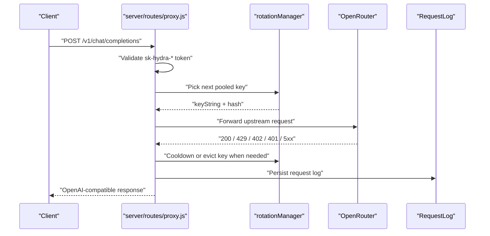

# Hydra Architecture Deep Dive

This document is the working map for Hydra. It is written for humans and other agents that need to continue the codebase without guessing how the parts fit together.

Hydra is not one monolith. It is a set of small flows that happen to share one UI:

- A local auth layer for the operator
- A metadata vault for OpenRouter accounts and keys
- A snapshot/aggregation layer for dashboard views
- A rotation-aware OpenAI-compatible proxy
- A browser automation layer for signup and fallback flows
- A discovery cache for OpenRouter internal routes
- A traffic log pipeline for proxy observability

If you understand those seven pieces, the repo becomes straightforward.

## System Topology

```mermaid
flowchart LR
  "Browser UI" --> "src/api.js"
  "src/api.js" --> "Express app (server/index.js)"
  "Express app" --> "Route controllers"
  "Route controllers" --> "Services"
  "Services" --> "Prisma SQLite"
  "Services" --> "OpenRouter"
  "Services" --> "Clerk"
  "Services" --> "Playwright"
  "Services" --> "Request logs"
  "Services" --> "Discovery cache"
```

The React app never talks directly to OpenRouter. Everything goes through the local Express server, and almost every interesting behavior is a service call behind a route.

## Startup Model

Hydra has two different ways to run:

- `npm run dev` starts the Vite client on `http://localhost:5173` (default; override with `HYDRA_VITE_PORT`) and the Express server on `http://localhost:3001` together (`concurrently` in `package.json`).
- `npm start` uses `launch.js` to run the production-style flow, verify the environment, and start the server that serves the built client from `dist/`.

Optional **global CLI** (same flows, discoverable one-word commands):

- [`bin/hydra.mjs`](../bin/hydra.mjs) — `hydra` → `node launch.js` (same as `npm start`), `hydra dev` → `npm run dev`, `hydra help`.
- Enable with `npm link` from the repo root (ties the global `hydra` to that clone). Documented in [`README.md`](../README.md) and [`DEVELOPMENT.md`](DEVELOPMENT.md).

**Research / constraints:** Browsers cannot spawn local Node from a web button; alternatives (Electron, Docker, etc.) are compared in [`HYDRA_LAUNCH_RESEARCH.md`](HYDRA_LAUNCH_RESEARCH.md).

For day-to-day UI work:

- React and CSS edits under `src/` usually hot reload through Vite.
- Backend edits under `server/` usually require restarting the `npm run dev` process so the Node process reloads code.

### Development: backend-down UX (no new HTTP routes)

In dev, the SPA is served by Vite; API calls go to relative `/api/...`, which Vite **proxies** to `http://localhost:3001` (`vite.config.js`). If Express is not running, `fetch` fails **before** any HTTP status — there is no new server route for “health” beyond existing endpoints.

**Client behavior:**

- [`src/api.js`](../src/api.js) `request()` — on network failure with `import.meta.env.DEV`, throws an `Error` with a longer message and attaches **`hydraCopyCommand`** (`'npm run dev'`) so pages can offer a **Copy command** affordance (still cannot start the server from the browser).
- [`src/components/DevBackendHint.jsx`](../src/components/DevBackendHint.jsx) — renders the message plus optional command + copy button (`data-testid="copy-dev-command"`).
- [`src/App.jsx`](../src/App.jsx) — initial auth check (`getAuthStatus` → `GET /api/auth/status`) failure lands in **SERVER OFFLINE**; in dev, uses `DevBackendHint` with the same copy command.
- [`src/pages/BulkAuthWizard.jsx`](../src/pages/BulkAuthWizard.jsx) — API `catch` blocks pass through `err.hydraCopyCommand` so bulk OTP errors show the hint when the backend is down.

**Exports for UI:** `HYDRA_DEV_START_COMMAND`, `HYDRA_DEV_API_ONLY_COMMAND` (also documented under **Frontend API client** in [`API_REFERENCE.md`](API_REFERENCE.md)).

## Request Pipeline

The canonical request path is:

1. A page calls a helper in `src/api.js`.
2. `src/api.js` sends the request to `/api/...` or `/v1/...`.
3. `server/index.js` routes the request to a controller or proxy route.
4. The controller validates input and calls service functions.
5. The service reads or writes Prisma data, calls OpenRouter/Clerk, or launches Playwright.
6. The result returns to the UI as JSON.

This is the pattern to follow when adding new features. Put route shape in `server/routes/`, logic in `server/controllers/` or `server/services/`, and keep `src/api.js` as the client-side contract.

## Authentication Layer

### Local operator login

The local Hydra UI is protected by a JWT-based auth flow:

- `GET /api/auth/status` tells the frontend whether setup is done, whether the token is valid, and whether a restart is required.
- `POST /api/auth/setup` creates the first local admin password.
- `POST /api/auth/login` issues a JWT after password validation.
- `POST /api/auth/logout` is stateless; the frontend drops the token.
- `POST /api/auth/change-password` updates the password and increments the token version.
- `POST /api/auth/nuke` wipes local data and marks the app as restart required.

Implementation details:

- `server/services/auth.js` owns password hashing, token issuance, token validation, and nuclear reset.
- `server/middleware/auth.js` checks the JWT and attaches `req.user`.
- Most app routes use `requireUnlocked`, which means they are only available after local login.

### Why this matters

Hydra separates the operator login from the OpenRouter credentials it manages. The local JWT controls access to Hydra itself. The `sk-or-*` and `sk-hydra-*` tokens are for OpenRouter and the proxy.

## Data Model

The important persistent objects are:

- `User` - local operator identity
- `Account` - one OpenRouter account record
- `Key` - one OpenRouter API key record
- `RequestLog` - proxy traffic history
- `Discovery` - cached internal OpenRouter tRPC route names
- `CachedModel` - locally cached model list

Encrypted storage layout:

- `account.config` stores account metadata such as `managementKey`, email, password, auth method, session cookie references, and sync timestamps.
- `account.sessionToken` stores the decrypted `__session` value.
- `key.key` stores the raw OpenRouter API key string.

The encryption and decryption helpers live under `server/services/storage-codec.js`, and the vault secrets come from `server/services/local-secrets.js`.

### Session expiry and dashboard session labels

After any successful Clerk session resolution (password, email OTP, TOTP, or `refreshSession`), Hydra persists **`config.sessionExpiry`** as an ISO timestamp derived in **`server/services/clerk-auth.js`** via **`getJwtExpiry(sessionCookie)`**. That helper decodes the JWT **`exp`** claim when present. If the token is missing **`exp`**, is not three segments, or the payload cannot be decoded, Hydra still stores a **non-null** expiry by falling back to **24 hours** from the resolution time. That keeps **`ensureSession`** / **`isSessionValid`** and the UI from treating a good login as “session unclear” solely because the upstream JWT omitted **`exp`**.

**`server/services/store.js`** **`getSessionStatus`** (used by **`GET /api/accounts`**, **`GET /api/dashboard`**, **`GET /api/accounts/:id/session-status`**) maps vault state to **`sessionStatus`**: **`none`** if there is no non-empty decrypted session token (and no legacy **`config.sessionCookie`**); **`active`** if a token exists but **`sessionExpiry`** is missing or not a valid date (legacy rows); **`expiring`** / **`expired`** / **`active`** from **`sessionExpiry`** when the date is valid. The server **does not** emit **`unknown`** for “token present, expiry missing” anymore—that case is **`active`** so OTP and credential-based accounts do not look logged out after a successful verify. The React app may still handle **`unknown`** defensively if present from older cached responses.

### `ensureSession` and persistent `sessionExpiry` (no new HTTP routes)

Session-backed dashboard work (management key provision, code redemption, internal tRPC) goes through **`dashboardApi.ensureSession(userId, accountId)`** in **`server/services/dashboard-api.js`**. **`isSessionValid`** in **`clerk-auth.js`** still requires a non-null ISO expiry with a five-minute buffer; to avoid treating a good **`__session`** as dead when the vault never stored an expiry, **`ensureSession`** uses an **effective** expiry of **`session.sessionExpiry || getJwtExpiry(session.sessionCookie)`** (JWT **`exp`**, else the same **24-hour** fallback as login).

**Order of operations inside `ensureSession`:**

1. **Reuse + backfill** — If **`__session`** exists and the effective expiry is valid: return immediately. If **`config.sessionExpiry` was missing** but the JWT-derived expiry is valid, **`store.updateAccountSession`** writes the derived ISO string so the next read and **`isSessionValid`** stay aligned with the token.
2. **`refreshSession(clientCookie)`** — Clerk **`GET /v1/client`** via **`clerkGetClientSession`** with **up to three attempts** and short backoff (same parameters as post-login **`getSessionToken`**), not a single attempt. On success, persist refreshed **`__session`**, device jar, and **`sessionExpiry`**.
3. **`validateSession(sessionCookie)`** — Probes OpenRouter **`GET /api/v1/credits`** with the cookie. On success, **`updateAccountSession`** persists **`getJwtExpiry(sessionCookie)`** so a live session is not left without a stored expiry after refresh failure.
4. **Password re-auth** — When the account has stored email/password and **`authMethod === 'password'`**, **`signInWithPassword`** runs as today.

**`preflightRedeemAccounts`** (used by **`POST /api/codes/preflight`**) mirrors **`ensureSession`** without network: “session already valid” uses **`session.sessionExpiry || getJwtExpiry(sessionCookie)`** for the same offline heuristic.

**Other writers of `sessionExpiry`:** **`getJwtExpiry`** is **exported** from **`clerk-auth.js`**. **`AccountController.detectAuth`** ( **`POST /api/accounts/:id/detect-auth`** ) backfills expiry from the existing **`__session`** when merging a new Clerk client cookie if the vault had no expiry. **`account-generator.js`** (Playwright signup completion) stores **`getJwtExpiry(sessionCookie)`** when saving the new account’s session, not **`null`**.

## Core Flows

### 1. Add an account

The UI path starts in `src/pages/Dashboard.jsx` and calls one of these wrappers from `src/api.js`:

- `addAccount(alias, managementKey)`
- `addAccountWithCredentials(alias, email, password, authMethod)`
- `bulkAddAccounts(lines)`

Route entry points:

- `POST /api/accounts`
- `POST /api/accounts/with-credentials`
- `POST /api/accounts/bulk`
- `POST /api/accounts/bulk-otp-stubs` — create many `authMethod: otp` rows from emails only (vault-only; SPA route `/bulk-auth`, component `src/pages/BulkAuthWizard.jsx`)

Backend flow:

1. `server/routes/accounts.js` forwards to `AccountController`.
2. `AccountController.addAccount()` validates the key with `assertManagementKey()`.
3. It probes OpenRouter with `openrouter.getCredits()` to make sure the management key is real.
4. `server/services/store.js` persists the account config encrypted in SQLite.

Bulk import is intentionally flexible:

- `alias:email:password`
- `email:password`
- raw session cookie lines

`bulkAdd()` decides which parser path to take for each line.

### 2. Provision or refresh a management key

Management keys are what let Hydra read balances and create/delete standard keys.

Relevant routes:

- `POST /api/accounts/:id/provision`
- `POST /api/accounts/provision-all`

Implementation:

- `AccountController.provision()` and `provisionAll()` call `dashboardApi.createManagementKey()`.
- `server/services/dashboard-api.js` first tries to reuse a valid session.
- If it has one, it attempts cached tRPC discovery, then a list of candidate tRPC routes, then Playwright fallback.
- When a management key is found, it is written back into the local encrypted account config with `store.updateAccountManagementKey()`.

**No clipboard in the automation path:** Provisioning does **not** click OpenRouter’s “Copy to clipboard” control. The implementation reads the secret from **tRPC JSON** or from **network/DOM text** inside server-side Playwright (`server/services/dashboard-api.js`). Assistant or operator browsers used only to **document** selectors (`docs/recon/TRPC_ROUTES.md`) do **not** persist keys into the vault.

**Manual paste path:** Operators can still set or replace a management key with **`PATCH /api/accounts/:id`** (`AccountController.updateAccount`). The Key Manager modal **`PasteManagementKeyModal`** adds a client-side **`sk-or-`** prefix check; the server uses non-empty validation plus **`openrouter.getCredits()`** (see **`docs/API_REFERENCE.md`**).

**Clerk session vs management key:** A valid dashboard **`__session`** (and device cookies) lets Hydra call dashboard-only paths (tRPC, or the Playwright fallback that drives `https://…/settings/management-keys`). That is **not** the same as storing a **management API key** (`sk-or-mgmt-…`): until provisioning succeeds and `updateAccountManagementKey` runs, Key Manager and OpenRouter REST management calls have nothing to authenticate with.

**Server-side Playwright vs Playwright MCP:** The fallback uses the **`playwright` npm package** inside the Hydra Node process (headless Chromium, cookie injection, `waitForResponse` on `/api/trpc/`). It is unrelated to **Playwright MCP** in the IDE, which is a separate tool for assistants to control a browser via MCP.

This is one of Hydra's key "aggregation" flows:

- The controller fans out across many accounts.
- The dashboard API tries multiple upstream strategies.
- The store aggregates the resulting management keys into one local vault.

### 3. Build the dashboard snapshot

The main dashboard page is a snapshot/aggregation layer, not a live push stream.

Route:

- `GET /api/dashboard`

Flow:

1. `DashboardController.getDashboard()` reads all accounts via `store.getAllAccountsWithKeys()`.
2. It staggers requests by 50ms per account so bursts are softer.
3. For each account it calls `openrouter.getAccountSnapshot()`.
4. `openrouter.getAccountSnapshot()` combines:
   - `getCredits()`
   - `listKeys()`
5. The controller reduces those per-account snapshots into totals for the top-level cards.

This is the "creation aggregation" pattern in practice:

- One per-account fetch becomes one aggregated dashboard payload.
- The UI renders totals and per-account cards from the same response.

### 4. Manage standard API keys

Key management routes sit under the account namespace:

- `GET /api/accounts/:accountId/keys`
- `POST /api/accounts/:accountId/keys`
- `PATCH /api/accounts/:accountId/keys/:hash`
- `DELETE /api/accounts/:accountId/keys/:hash`

Implementation:

- `KeyController.listKeys()` calls `openrouter.listKeys()` using the stored management key.
- `KeyController.createKey()` calls `openrouter.createKey()`, then saves the returned raw key string with `store.saveKey()`.
- `KeyController.updateKey()` and `deleteKey()` call the OpenRouter management API directly.

Important detail:

- A key must have its raw key string stored locally before it can participate in the proxy pool.
- `store.updateKeyPooledStatus()` refuses to pool a key if the encrypted raw key string is missing.

**Management key vs standard key secret:** Provisioning (`POST /api/accounts/:id/provision`) or credential login stores a **management** key (`sk-or-mgmt-…`). That authorizes `listKeys` and `createKey` on OpenRouter. The vendor API does **not** return existing standard key secrets—only metadata (hash, name, usage). OpenRouter shows the raw `sk-or-v1-…` string **once** at key creation. Keys synced into Hydra via `listKeys` therefore start without an encrypted `key.key` row until the user pastes the secret in Pool Manager (`POST /api/pool/key/:hash/register`) or creates a new key through Hydra (which persists the secret from `createKey`). We intentionally do not wrap `GET /api/v1/keys/{hash}` for “recovery”: its documented response is metadata-only, not the secret. **Re-logging in** does not restore lost standard key strings. **Operator-facing copy** for this behavior lives in [`src/pages/PoolManager.jsx`](../src/pages/PoolManager.jsx) under the **About keys** header control (popover), not a separate doc route.

### 5. Sync and operate the pool

Pool management is the bridge between stored account keys and the proxy.

Relevant routes:

- `GET /api/pool`
- `GET /api/pool/status`
- `GET /api/pool/master-key`
- `GET /api/pool/network`
- `PATCH /api/pool/key/:hash`
- `POST /api/pool/account/:accountId/toggle`
- `POST /api/pool/key/:hash/register`
- `POST /api/pool/reload`
- `POST /api/pool/models/refresh`
- `GET /api/pool/traffic`

Backend flow for `GET /api/pool`:

1. `PoolController.getPoolData()` loads all accounts and keys from the local vault.
2. For each account with a management key, it calls `openrouter.listKeys()`.
3. `store.syncKeysFromOpenRouter()` upserts metadata about those live keys into SQLite.
4. The controller merges DB state with live OpenRouter state.
5. It adds `rotationManager.getStatus()` so the UI knows how many pooled keys are available, cooling down, or missing key strings.
6. It adds `modelCache: { count, updatedAt }` from `server/services/model-cache.js` so the Pool Manager can show catalog cache age without an extra request.

This route is important because it acts like a sync point:

- OpenRouter is the source of truth for live remote key metadata.
- SQLite is the local cache and policy store.
- The controller reconciles the two.

`PoolController.getMasterKey()` derives the `sk-hydra-...` token from the local proxy secret and returns the proxy endpoint. The Settings page uses this for external clients.

`PoolController.getNetworkInfo()` scans local interfaces so the UI can suggest LAN URLs such as `http://192.168.x.x:3001/v1`.

### 6. Route OpenAI-compatible traffic

Hydra exposes a proxy at `/v1/*`, not under `/api`.

Important behavior:

- `server/routes/proxy.js` validates the `Authorization: Bearer sk-hydra-...` header.
- `GET /v1/models` returns a model list.
- All other `/v1/*` requests are forwarded to OpenRouter.

Proxy flow:

1. The request arrives in `server/routes/proxy.js`.
2. `validateMasterKey()` checks the derived `sk-hydra-...` token.
3. If the request is `GET /v1/models`, `handleModels()` prefers rows in `CachedModel` (via `model-cache.js`), else fetches OpenRouter using `OR_BASE`, upserts into SQLite (write-through), else returns a static fallback. Sets `X-Hydra-Models-Source` (`cache` / `live` / `static`).
4. For all other requests, `rotationManager.getNextKey()` chooses a pooled key.
5. The proxy forwards the request upstream with that key.
6. Errors update pool state:
   - `429` means cooldown the key for 60 seconds
   - `402` means cooldown the key for 10 minutes
   - `401` means permanently evict the key from rotation
7. Successful responses are streamed or JSON-forwarded back to the client.
8. Each request is logged to `RequestLog` with latency and token counts.

For optional **CLIProxyAPI** / **LiteLLM** sidecars, architecture decision, and borrowable patterns, see [`CLIPROXYAPI_GATEWAY_SYNTHESIS.md`](CLIPROXYAPI_GATEWAY_SYNTHESIS.md).



### 7. Rotate keys safely

`server/services/rotation-manager.js` is in-memory policy on top of local DB state.

It does three things:

- Keeps a pool of decrypted pooled keys
- Applies temporary cooldowns to unhealthy keys
- Evicts revoked keys

Selection strategy:

- It prefers active keys with larger remaining limits.
- If weighting fails, it falls back to round-robin.

The health pinger in `server/services/health-pinger.js` periodically hits OpenRouter with a cheap test request so the pool can discover dead, limited, or out-of-credit keys before a user request hits them.

### 8. Redeem codes

Code redemption is another fallback-heavy upstream workflow.

Routes:

- `POST /api/codes/redeem`
- `POST /api/codes/bulk`
- `POST /api/codes/bulk-matrix`
- `POST /api/codes/preflight`
- `GET /api/codes/endpoints`

Implementation:

- `CodeController.redeem()` calls `dashboardApi.redeemCode()`.
- `bulkRedeem()` loops account-by-account to avoid Playwright overload.
- `bulkMatrix()` supports arbitrary account/code assignments.
- `preflight()` calls `dashboardApi.preflightRedeemAccounts()` so the UI can list accounts that lack any `ensureSession()` path (dashboard session / refresh / password re-auth). Management keys alone do not satisfy redemption.
- `getEndpoints()` returns the local discovery cache so the app can remember which internal tRPC route worked last time.

The important service behavior is in `server/services/dashboard-api.js`:

- It first reuses a valid session or refreshes it (`ensureSession`).
- It then tries a **cached** redeem tRPC route from `getDiscoveredEndpoints().redeemCode` (with `Referer: …/redeem`), stopping on **permanent** upstream errors.
- If the cache misses or returns transient/wrong-procedure errors, it walks a **fixed candidate list** of procedure names until one returns JSON success or a permanent failure.
- If all tRPC attempts are exhausted without success, it falls back to **Playwright** (`redeemCodeViaPlaywright`): inject Clerk cookies, optionally snapshot **`getCredits`** (management API) for **total** before submit, register **`waitForResponse`** for a **`POST /api/trpc/*`** whose body contains the promo code, then submit the form. Outcome resolution is **ordered**: parsed browser tRPC JSON → failure-first UI heuristics → credits **total** increase poll → legacy success regex → **`REDEEM_OUTCOME_UNKNOWN`** with **`uiFeedback`**. Success is **not** inferred from “no failure match.”
- **Route discovery:** successful `trpcCall`, Playwright **`page.on('response')`**, or a captured tRPC response updates `saveDiscoveredEndpoints({ redeemCode })` so the next run prefers tRPC again.

That discovery cache is one of the core "learn as you go" mechanisms in Hydra.

**tRPC vs Playwright for redeem:** The **tRPC** path (`POST /api/trpc/...` with Clerk cookies and redeem-specific `Referer`) is the **production** path: one HTTP round-trip, low overhead, suitable for bulk matrix redeem. **Playwright** is a **fallback** and a **discovery** aid—the live UI may hit **POST `/redeem`** (Server Actions), which Hydra does not mimic directly; manual or automated browser sessions instead help confirm selectors and occasionally surface tRPC URLs. Prefer tRPC whenever it returns JSON; see [TRPC_ROUTES.md](recon/TRPC_ROUTES.md#redeem-trpc-vs-browser-automation-compare--contrast). **Operator-facing fields** (`verification`, `uiFeedback`, credits snapshots) and the full **errorCode** table are documented in [API_REFERENCE.md](API_REFERENCE.md#code-redemption-routes) under **Code Redemption Routes**.

### 9. Generate accounts with Playwright

The generator is a paused workflow, not a synchronous request.

Routes:

- `POST /api/generator/start`
- `GET /api/generator/status/:jobId`
- `POST /api/generator/verify/:jobId`
- `DELETE /api/generator/:jobId`

Flow:

1. `GeneratorController.startSignup()` creates a job in memory.
2. `server/services/account-generator.js` launches Playwright.
3. It navigates to the OpenRouter signup flow.
4. When OTP is required, the job pauses and waits for user input.
5. `submitOtpForJob()` resumes the browser, extracts session cookies, saves the new account locally, and provisions a management key through `dashboardApi.createManagementKey()`.

This is another compound flow:

- Browser automation creates the account.
- Session cookies are stored locally.
- Management key provisioning happens immediately after.
- The dashboard then sees the new account on the next refresh.

### 10. Handle Clerk webhooks

Route:

- `POST /api/webhooks/clerk`

Implementation:

- `server/routes/webhooks.js` accepts the webhook payload.
- `server/services/webhook-idempotency.js` writes a normalized event ID into a small SQLite table.
- Duplicate events return `202` and are ignored.

This keeps Clerk retries from causing duplicate work.

## Frontend Entry Points

The React pages map cleanly to backend domains:

- `src/pages/Dashboard.jsx` → `/api/accounts`, `/api/dashboard`
- `src/pages/KeyManager.jsx` → `/api/accounts/:id/keys`
- `src/pages/PoolManager.jsx` → `/api/pool`, `/v1`, `/api/pool/network`
- `src/pages/CodeRedemption.jsx` → `/api/codes/*`
- `src/pages/Generator.jsx` → `/api/generator/*`
- `src/pages/Settings.jsx` → `/api/auth/*`, `/api/pool/network`
- `src/pages/Traffic.jsx` → `/api/pool/traffic`

Client-side wrappers live in `src/api.js`. When adding a feature, update the wrapper first so the UI stays consistent.

## Route and Service Index

| Area | Route entry | Primary controller | Primary service work |
| --- | --- | --- | --- |
| Auth | `/api/auth/*` | `AuthController` | `server/services/auth.js` |
| Accounts | `/api/accounts/*` | `AccountController` | `store`, `openrouter`, `clerk-auth`, `dashboard-api` |
| Keys | `/api/accounts/:accountId/keys/*` | `KeyController` | `openrouter`, `store` |
| Dashboard | `/api/dashboard` | `DashboardController` | `store`, `openrouter` |
| Codes | `/api/codes/*` | `CodeController` | `dashboard-api`, `store` |
| Generator | `/api/generator/*` | `GeneratorController` | `account-generator` |
| Pool | `/api/pool/*` | `PoolController` | `store`, `openrouter`, `rotationManager`, `model-cache` |
| Proxy | `/v1/*` | `server/routes/proxy.js` | `rotationManager`, `store`, `model-cache`, `RequestLog` |
| Webhooks | `/api/webhooks/clerk` | route handler | `webhook-idempotency` |

**Clerk FAPI (`server/services/clerk-auth.js`):** For flows that must obtain **`__session`**, Hydra uses **`clerkHttpsJson`** (Node **`https.request`**) against `CLERK_BASE` so **`set-cookie`** is always available as `string | string[]`. That covers **`attempt_first_factor`** (password and **`email_code`** verify), **`attempt_second_factor`** (TOTP), **`GET /client`** for session resolution, and **`refreshSession`**. **`prepare_first_factor`** (email OTP *send*) still uses **`fetch`**; responses are merged with **`clientCookieAfterResponse`** / **`getSetCookie()`** where applicable.

**Device cookie jar:** The vault field **`clientCookie`** is a single HTTP **`Cookie`** header value that may include several Clerk device cookies merged from **`Set-Cookie`** over the flow—at minimum **`__client`**, and commonly **`__client_uat`** plus instance-specific **`__client_uat_*`**. FAPI and dashboard **`openrouter.ai`** requests replay this full string so OTP verify and dashboard session behavior stay aligned with a browser device.

After each step, merge any new device cookies from `Set-Cookie` before the next Clerk call. Session resolution after **`status=complete`** (password, email OTP, or TOTP second factor) follows this order: **`__session`** from `Set-Cookie`; embedded JWT via **`sessionJwtFromClerkClientPayload`**, which scans **`client`**, Client-shaped **`response`**, raw **`response`**, and **`client.sign_in`** for **`session` / `sessions` / `last_active_session`** (and camelCase variants), including **`sessions[]`** entries with **`jwt`** or **`last_active_token.jwt`**. If still missing and the sign-in payload includes **`created_session_id`** / **`createdSessionId`**, Hydra calls **`POST /v1/client/sessions/{id}/touch`** (browser **`setActive`** parity), then re-reads cookies and the touch response body. Finally **`getSessionToken`** issues **`GET /client`** over HTTPS (up to three attempts with short backoff) using the updated **`__client`**.

**Debugging:** `CLERK_DEBUG_OTP=1` logs Set-Cookie **names** (not values), **`sign_in`** key hints (**`created_session_id`**, etc., presence only), and the same style of lines for each **`GET /client`** attempt during fallback resolution—not only after email OTP **`attempt_first_factor`**. **`CLERK_ORIGIN`** / **`CLERK_REFERER`** override default browser-parity headers (see **`.env.example`**). Run **`npm run check:clerk`** to verify TLS and **`Set-Cookie`** visibility from this host. With debug on, **`AccountController`** errors on Clerk-heavy paths (`login`, **`otp/start`**, **`otp/verify`**, **`detect-auth`**, **`refresh`**) also return JSON **`clerkDebugOtp: true`** and **`clerkDebugHint`**; **`src/api.js`** surfaces the hint in the UI via **`formatApiErrorMessage`**. Details: `IMPLEMENTATION_PLAN.md` (Clerk FAPI section).

## What To Read Next

- `API_REFERENCE.md` for the exact route catalog.
- `DEVELOPMENT.md` for startup and restart behavior.
- `PROJECT_STRUCTURE.md` for a concise file map.
- `BRANDING.md` for the visual system, including the space background layers.

If you are an agent continuing work here, this is the path I would follow:

1. Read `ARCHITECTURE_DEEP_DIVE.md`
2. Read `API_REFERENCE.md`
3. Read `src/api.js`
4. Read the route file for the area you are changing
5. Read the corresponding controller and service
